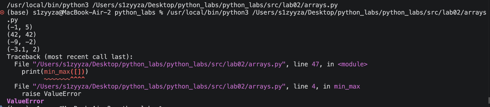
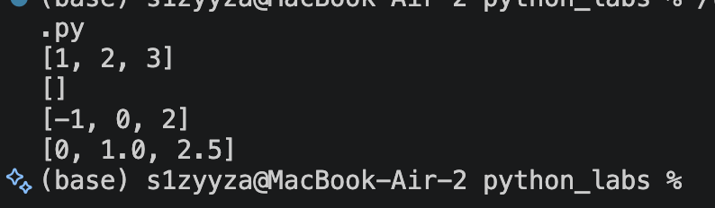
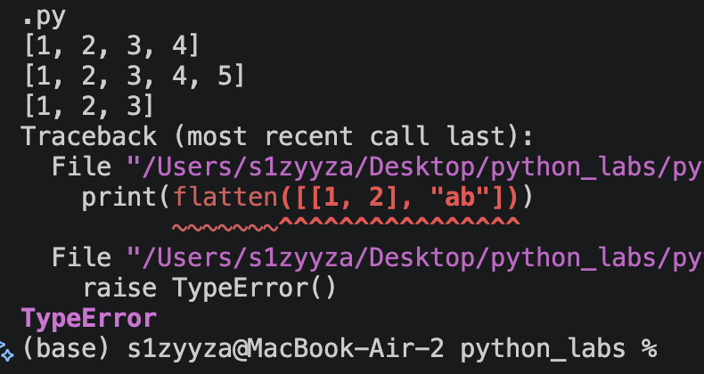
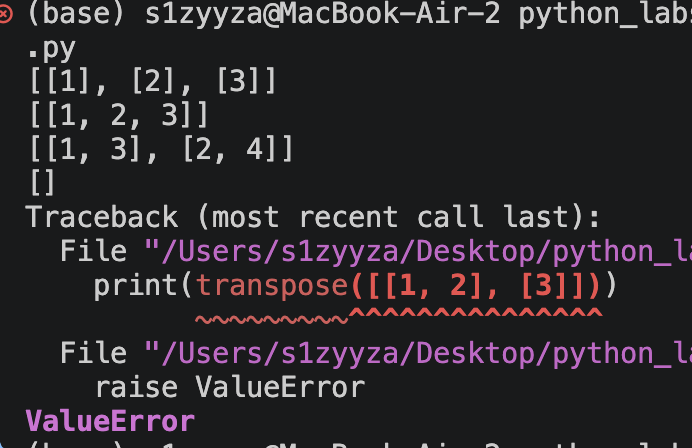
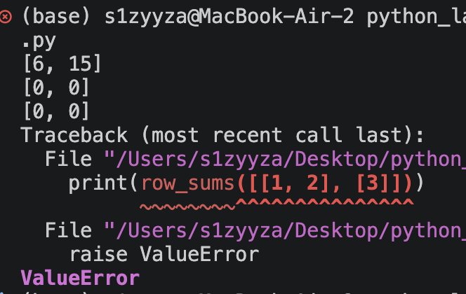
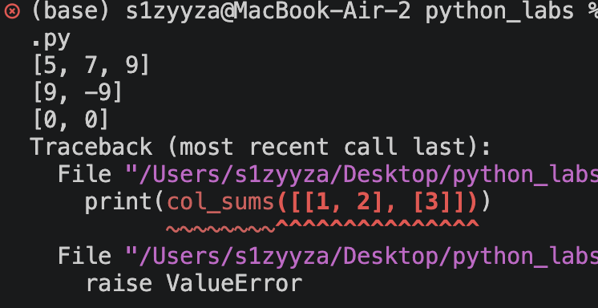
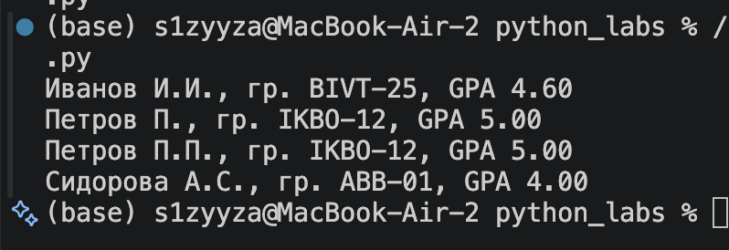

# Лабораторная работа 2

## Задание 1


#### Модуль даёт три функции — min_max(nums) возвращает (min, max) и кидает ValueError на пустом списке, unique_sorted(nums) возвращает отсортированные уникальные значения, flatten(mat) разворачивает список списков/кортежей в 1 и кидает TypeError при вложенности.

```python
def min_max(nums: list[float | int]) -> tuple[float | int, float | int]:
  
    if len(nums) == 0:
        raise ValueError
    
    max = nums[0]
    min = nums[0]
    
    for i in nums:
        if i > max:
            max = i
        if i < min:
            min = i
    return min,max

def unique_sorted(nums: list[float | int]) -> list[float | int]:
   
    if len(nums) == 0:
            return []
        
    last = list(set(nums))
    for i in range(len(last)):
        for j in range(i + 1, len(last)):
            if last[j] < last[i]:
                last[i], last[j] = last[j], last[i]
    return last


def flatten(mat: list[list | tuple]) -> list:

    a = []
    for i in mat:
        if not isinstance(i, (list, tuple)):
            raise TypeError()
        for j in i:
            if isinstance(j, (list, tuple)):  
                raise TypeError()
            a.append(j)
            
    return a
            
```

# Вывод





## Задание 2

#### transpose транспонирует, row_sums и col_sums считают суммы по строкам и столбцам, пустая матрица даёт пустой результат, а «рваная» вызывает ValueError

```python

def transpose(mat: list[list[float | int]]) -> list[list]:
    
    if len(mat) == 0:
        return []

    lgh = len(mat[0])
    
    for row in mat:
        if len(row) != lgh:
            raise ValueError
    
    matr = []
    for j in range(lgh):
        res = []
        for i in range(len(mat)):
            res.append(mat[i][j])
        matr.append(res)
    return matr

def row_sums(mat: list[list[float | int]]) -> list[float]:
    
    if mat:

        lgh = len(mat[0])
    
        for row in mat:
            if len(row) != lgh:
                raise ValueError
            
    return [sum(row) for row in mat]
    

def col_sums(mat: list[list[float | int]]) -> list[float]:
    
    if len(mat)==0:
        return []

    lgh = len(mat[0])
    
    for row in mat:
        if len(row) != lgh:
            raise ValueError

    result = []
    for j in range(lgh):
        s = 0
        for i in range(len(mat)):
            s += mat[i][j]
        result.append(s)
    return result
```
# Вывод







## Задание 3

#### format_record валидирует кортеж (str, str, float) и возвращает нормализованную строку «Фамилия И.О., гр. группа, GPA X.XX», выбрасывая TypeError при неверных типах/длине и ValueError при недостатке частей ФИО, пустой группе или GPA вне [0.0, 5.0]

```python
def format_record(rec: tuple[str, str, float]) -> str:
    
```python
def format_record(rec: tuple[str, str, float]) -> str:
    
    if not isinstance(rec, tuple) or len(rec) != 3:
        raise TypeError("rec должен быть кортежем из трёх элементов: (ФИО, группа, GPA)")

    fio, group, gpa = rec

    if not isinstance(fio, str):
        raise TypeError("ФИО должно быть строкой")
    if not isinstance(group, str):
        raise TypeError("Группа должна быть строкой")
    if not isinstance(gpa, (int, float)):
        raise TypeError("GPA должен быть числом типа int или float")
    
    parts = fio.split()
    if len(parts) < 2:
        raise ValueError("ФИО должно содержать минимум фамилию и имя")

    last_name = parts[0].capitalize()
    initials = "".join(p[0].upper() + "." for p in parts[1:3])

    
    group = " ".join(group.split())
    if not group:
        raise ValueError("группа не может быть пустой")

   
    if not (0.0 <= gpa <= 5.0):
        raise ValueError("GPA должен быть в диапазоне [0.0, 5.0]")

    return f"{last_name} {initials}, гр. {group}, GPA {gpa:.2f}"

```
# Вывод


